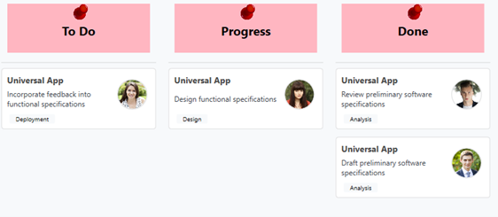

# How-to-customize-the-header-of-WPF-Kanban
This article explains how to add the desired view in the header of [Syncfusion WPF SfKanban control]() cards as show in below.

 

It has been achieved by using ColumnHeaderTemplate support. We can add the desired view into template view as shown in below code snippet.

[XAML]

```
          <syncfusion:SfKanban ColumnMappingPath="Category" Background="LightPink" ItemsSource="{Binding Tasks}" >
            <syncfusion:SfKanban.ColumnHeaderTemplate>
                <DataTemplate>
                    <StackPanel Width="300" Height="80" Margin="10"  Background="LightPink" HorizontalAlignment="Center" VerticalAlignment="Center">
                        <Image Source="pin.png" Height="30" Width="30"/>
                        <TextBlock  Text="{Binding  Header}" FontSize="20" Foreground="Black"  FontWeight="Bold" HorizontalAlignment="Center"/>
                    </StackPanel>
                </DataTemplate>
            </syncfusion:SfKanban.ColumnHeaderTemplate>
            <syncfusion:KanbanColumn Categories="Open" Title="To Do" />
            <syncfusion:KanbanColumn Categories="In Progress" Title="Progress" />
            <syncfusion:KanbanColumn Categories="Review,Done" Title="Done" />
         </syncfusion:SfKanban>
```
**ColumnHeaderTemplate of Kanban keeps [ColumnTag](https://help.syncfusion.com/wpf/kanban-board/column#column-tags) as DataContext.**

KB article - [How-to-customize-the-header-of-WPF-Kanban](https://www.syncfusion.com/kb/12297/how-to-customize-the-header-of-wpf-kanban-board)

# See also

[How to add the card template to the WPF SfKanban cards](https://help.syncfusion.com/wpf/kanban-board/cards#template)

[How to Placeholder in Xamarin SfKanban](https://help.syncfusion.com/wpf/kanban-board/placeholderstyle)

[How to customize the column in WPF SfKanban](https://help.syncfusion.com/wpf/kanban-board/column)


